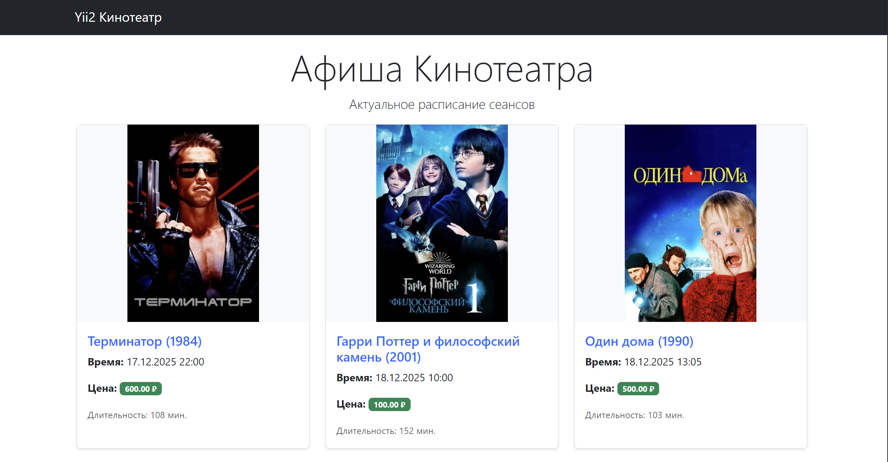
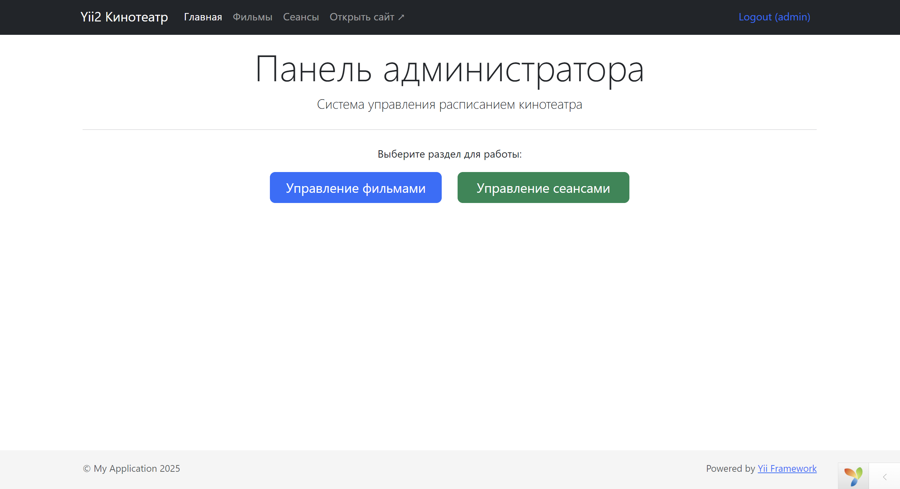
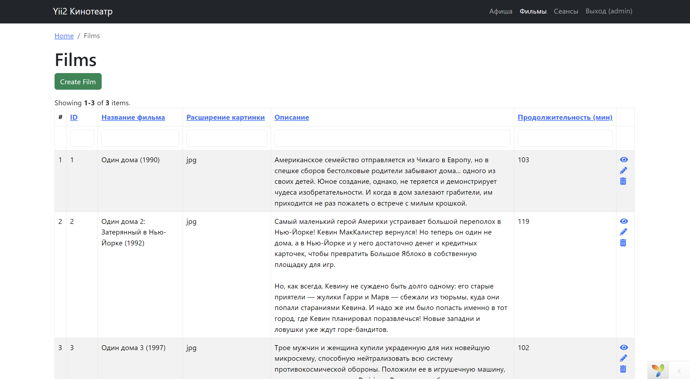
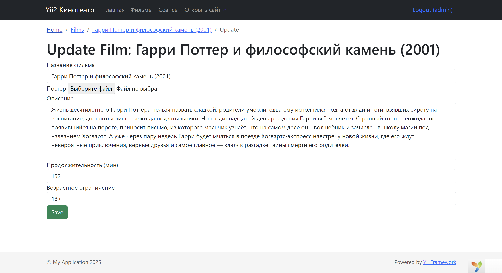
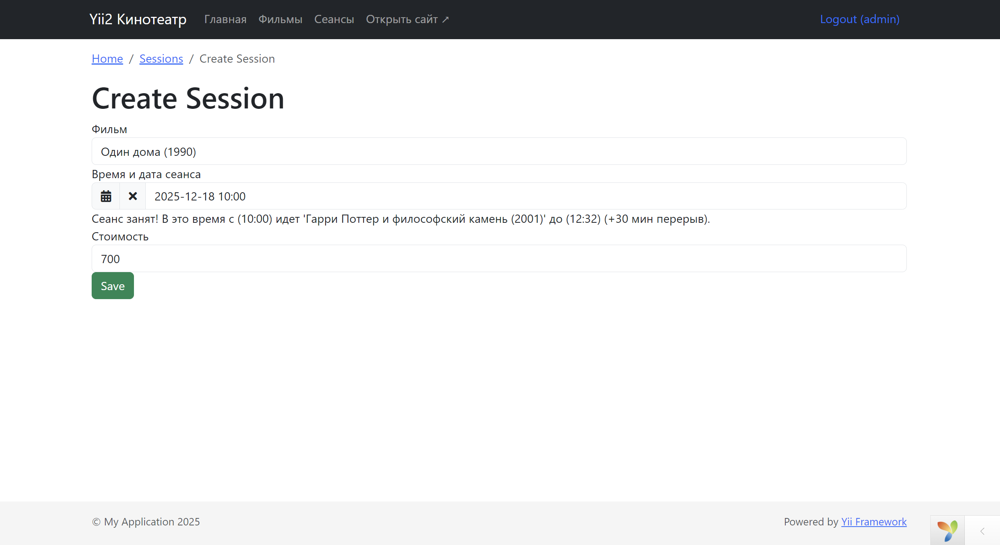

# Yii2 Cinema (Advanced Version)

Тестовое задание: Реализация системы управления расписанием кинотеатра.

**Версия 2.0:** Полный рефакторинг проекта с переходом на архитектуру **Yii2 Advanced Template**.

## Функционал и улучшения (v2)

### Клиентская часть (Frontend)
- **Просмотр афиши:** Адаптивная сетка с карточками фильмов.
- **Сортировка:** Сеансы автоматически сортируются хронологически (от ближайших).
- **Чистота:** Убрана лишняя навигация (Login/Signup), оставлен только публичный просмотр.

### Админ-панель (Backend)
- **Безопасность:** Отдельное приложение для администраторов.
- **Фильмы (CRUD):**
    - Загрузка изображений (автоматическое создание папок).
    - **Smart Cleanup:** Автоматическое удаление старого файла при замене постера или удалении фильма.
    - Выпадающие списки (Dropdown) для стандартизации данных (возрастной рейтинг).
- **Сеансы (CRUD):**
    - **UI:** Виджет календаря с поддержкой Bootstrap 5 (Kartik DateTimePicker).
    - **Валидация цены:** Строгая проверка типов и формата.
    - **Валидация коллизий:** Система не дает создать сеанс, если зал занят в это время (учитывается длительность фильма + 30 мин перерыв).
    - **Визуал:** Отображение миниатюр постеров в таблицах.

## Технологии
- **Framework:** Yii2 Advanced Template
- **DB:** MySQL / MariaDB
- **UI:** Bootstrap 5
- **Widgets:** `kartik-v/yii2-widget-datetimepicker`
- **Architecture:**
  - Разделение на `frontend` и `backend`.
  - **Fat Model:** Вся бизнес-логика (валидация времени, загрузка файлов, обработка событий) вынесена в модели `common`.

## Скриншоты

### 1. Афиша (Frontend)


### 2. Админ-панель: Дашборд


### 3. Управление фильмами (с превью)


### 4. Редактирование фильма (Загрузка фото)


### 5. Создание сеанса (Календарь + Валидация)


## Установка и Запуск

1. **Клонирование и зависимости**
```bash
git clone https://github.com/IlnurSK/yii2-cinema
cd yii2-cinema
composer install
```

2. **Инициализация проекта**

Так как это Advanced шаблон, необходимо инициализировать окружение:
```bash
php init
# В диалоге выбрать: [0] Development -> yes
```

3. **Настройка Базы Данных**

Создайте базу данных и пользователя.

**Быстрый старт (Linux/WSL):**
```bash
sudo service mysql start
sudo mysql
```

**SQL-команды:**
```sql
CREATE DATABASE cinema_db;
CREATE USER 'yii_user'@'localhost' IDENTIFIED BY 'secret';
GRANT ALL PRIVILEGES ON cinema_db.* TO 'yii_user'@'localhost';
FLUSH PRIVILEGES;
EXIT;
```
Настройки подключения находятся в `common/config/main-local.php`.
```php
'components' => [
        'db' => [
            'class' => \yii\db\Connection::class,
            'dsn' => 'mysql:host=localhost;dbname=cinema_db',
            'username' => 'yii_user',
            'password' => 'secret',
            'charset' => 'utf8',
        ],
```
**Примените миграции:**
```bash
php yii migrate
```

4. **Настройка изображений (Symlink)**

Для того чтобы админ-панель видела картинки, загруженные на фронтенд, нужно создать символическую ссылку.

**Linux / macOS / WSL:**
```bash
cd backend/web
ln -s ../../frontend/web/uploads uploads
cd ../..
```

5. **Создание Администратора (SQL)**

Для входа в админ-панель необходимо создать пользователя со статусом `10` (ACTIVE). Выполните этот SQL-запрос в вашей базе данных (`cinema_db`).

**Пользователь**: `admin` **Пароль**: `admin`
```sql
INSERT INTO `user` (`username`, `auth_key`, `password_hash`, `email`, `status`, `created_at`, `updated_at`) 
VALUES 
(
    'admin', 
    'auth_key_random', 
    -- Хэш для пароля 'admin' (cost 13)
    '$2y$13$P/Xy.j3/K.Q6.Q6.Q6.Q6.Q6.Q6.Q6.Q6.Q6.Q6.Q6.Q6.Q6.Q6', 
    'admin@cinema.com', 
    10, -- STATUS_ACTIVE
    UNIX_TIMESTAMP(), 
    UNIX_TIMESTAMP()
);
```

6. **Запуск серверов**

Advanced шаблон требует запуска двух приложений (или настройки веб-сервера).

**Frontend (Афиша для гостей): http://localhost:8080**
```bash
php yii serve --docroot="frontend/web" --port=8080
```

**Backend (Админка): http://localhost:8081**
```bash
php yii serve --docroot="backend/web" --port=8081
```

Логин: `admin` / Пароль: `admin`