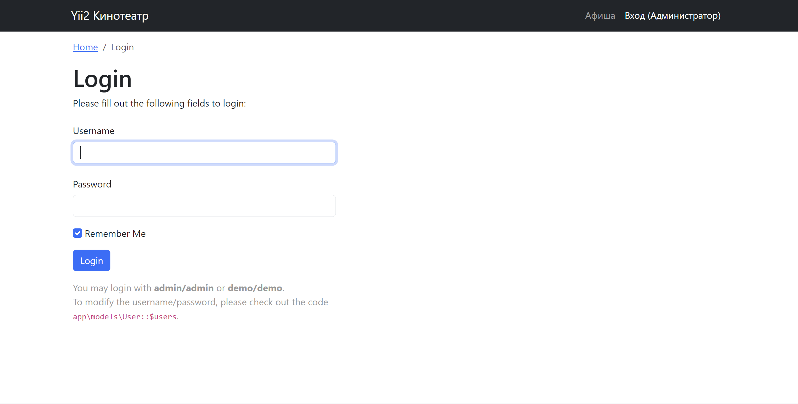
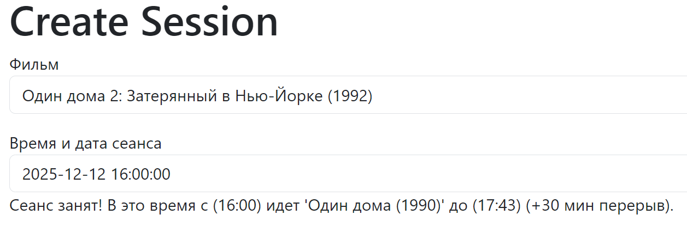

# Yii2 Cinema (Test Task)

Тестовое задание: Реализация системы управления расписанием кинотеатра.

## Функционал

### Клиентская часть (Гость)
- Просмотр афиши (карточки фильмов).
- Сортировка сеансов: от ближайших к дальним.
- Адаптивная верстка (Bootstrap 5).

### Админ-панель (Доступ: admin/admin)
- **Фильмы:** CRUD, загрузка постеров (сохранение с ID фильма), валидация расширений.
- **Сеансы:**
   - Визуальный календарь (Kartik DateTimePicker).
   - **Валидация коллизий:** Система не дает создать сеанс, если зал занят (с учетом длительности фильма + 30 мин перерыв).
   - Фильтрация и сортировка.

## Технологии
- **Framework:** Yii2 Basic
- **DB:** MySQL / MariaDB
- **Widgets:** `kartik-v/yii2-widget-datetimepicker`
- **Architecture:** MVC, Fat Model (логика валидации и загрузки файлов вынесена в Модели).

## Скриншоты

### 1. Афиша (Главная)


### 2. Страница авторизации (в админ-панель)


### 3. Страница администрирования фильмов


### 4. Страница администрирования сеансов


### 5. Страница создания сеансов


### 6. Валидация времени (Защита от накладок)


## Установка

1. Клонировать репозиторий:
```bash
git clone https://github.com/IlnurSK/yii2-cinema
cd yii2-cinema
```

2. Установить зависимости:
```bash
composer install
```

3. Настройка Базы Данных (Быстрый старт)

Проект настроен на пользователя `yii_user` с паролем `secret`. Самый быстрый способ запустить проект — создать этого пользователя и базу через консоль.

* Обновить список пакетов
`sudo apt update`
* Установить MariaDB
`sudo apt install mariadb-server`
* Запустить службу
`sudo systemctl start mariadb`

Запустите сервер БД (для Linux/WSL):
```bash
sudo service mysql start
```
Зайдите в консоль MySQL (под root):
```bash
sudo mysql
```
Выполните SQL-команды:
```sql
-- 1. Создаем базу данных
CREATE DATABASE cinema_db;

-- 2. Создаем пользователя (как в конфиге приложения)
CREATE USER 'yii_user'@'localhost' IDENTIFIED BY 'secret';

-- 3. Даем права на базу
GRANT ALL PRIVILEGES ON cinema_db.* TO 'yii_user'@'localhost';

-- 4. Применяем изменения и выходим
FLUSH PRIVILEGES;
EXIT;
```

4. Применение миграций:
```bash
php yii migrate
```
5. Запустить сервер:
```bash
php yii serve
```
Проект доступен по адресу: http://localhost:8080/

6. Доступ в админ панель:
login:`admin`
password:`admin`
